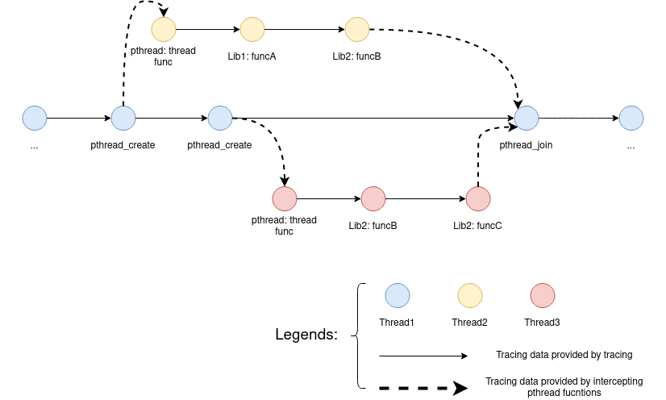
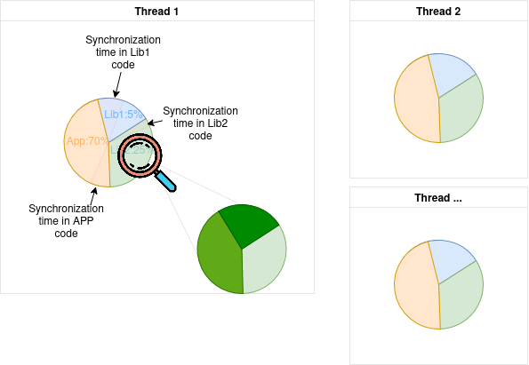

# Scaler: Holistically Pinpoint Scalability Bottleneck In Whole System Stack

## Overview

A tool to identify scalability issues in C/C++ programs. Then we will consider to extend to identify issues for machine learning programs. 

About Scaler, we may verify it on Firefox application (with multiple tabs to store, see Shan Lu's paper-2012), or other applications used in wPerf. 

We may also use the interception to detect tail performance issues. For instance, we could dump the specific data flow information into the file if the latency is over the average. Then we may find some commonalities between these abnormal ones. We could try to utilize such mechanism to identify the reason of server applications. We will only require uses to provide some input and output function, and then we will try to identify the reason of tail latency. 
Some related studies:
https://www.weave.works/blog/the-long-tail-tools-to-investigate-high-long-tail-latency/

What type of contributions: 

1. Proposes to utilize the data flow between components to identify the performance bottleneck. This principled method could be utilized to find the bottleneck inside the whole software stack. 
2. Develops a detailed method of capturing data flow between components. That is, we propose to intercept PLT invocations to identify data flow among components, which requires no changes of programs and imposes medium overhead. 
3. Proposes multiple integration techniques to further identify root causes of performance bottlenecks. For instance, we could integrate information of serial and parallel phases, component-based, system call-based integration. We further design a visualized tool to visualize the performance bottleneck. 
4. We performed extensive studies on a range of applications to evaluate the effectiveness of the approach. We further utilizes two sets of applications to evaluate the performance overhead and memory overhead of the proposed approach. Our conclusion is that Scaler can identify a range of performance issues while only imposing acceptable overhead. 

Possible shortcomings: 
This is not able to detect cache-related issues. Therefore, can combine with cache-related tools to consist of a full set of tools for performance analysis. 

## Exchanges with other people

We should do something (based on the communication with Yang Wang): 
- First, we will need to compare it with perf!
- Second, we may try to use Coz for this case, to see how much performance improvement that we could achieve. 

## Ideas

### What do we record?



We record tuple **(libName, threadID, timestamp)** for every external function call. We also need to **intercept pthread functions** to record the synchronization information.

### Show useful information to the user

The followings are current thoughts. We shouldn't be confined by this.



We will be able to tell the user the following info:

- Which library is slow for each thread?
- Which library called by a library is slow?
- Which external function is slow?
- Whether the slowdown is caused by code, synchronization, external functions?


We may use wPerf-like method to visualize the synchronization part.


Open problems: 

- If each thread has one figure, how to summarize these info? (Since we often have thousands of threads)
- How to represent the wait-for relationship. So that user can get more details of why the synchronization happens.
- Whether the graph is so complex that we need to simplify using wPerf.

### Predict potential speedup

Tools like Coz predict potential speedup by slowing down other threads and profiling a second time. In Scaler, we may calculate the speedup by trying to shorten each function call time and calculate a theoretical speedup. 

### Analyze parameters

Parameters passed to an external function is likely to have strong relations with the running time of that function. It might be useful to provide analysis of running time with respect to parameter data.

We may not do this because:
- May incur high overhead
- Difficult to analyze
- Need application to have debugging symbol, which may make people complain.


## Development

libAnalyzer will develop under **dev-libAnalyzer**

libScalerHook will develop under **dev-libScalerHook**

Notes and documentation should be placed in **docs**, and **ReadMe.md**. These documentations will develop under **master** branch.

All unit tests are placed in ./unittests/library name/*. Preferably, all tests should use **gtest**.

**Master branch should contain the latest, working version of Scaler.**

Clone this repo

```
git clone git@github.com:UTSASRG/Scaler.git
```

Init submodules

```
git submodule update --init --recursive --depth=1
```

When a upstream branch updates, and you haven't pushed your updates. Always try the following command first rather than using merge directly.

```
git stash push
git rebase
git stash pop
```

**Don't** use the following command unless you clearly know the impact and is certain that others won't be affected.

```
git push -f 
```

