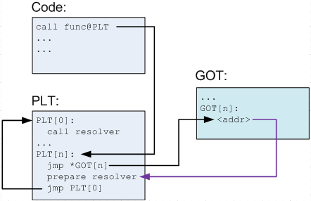
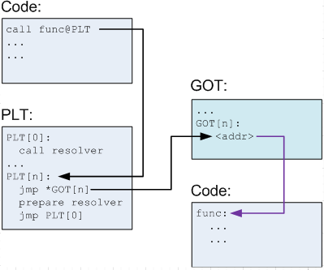
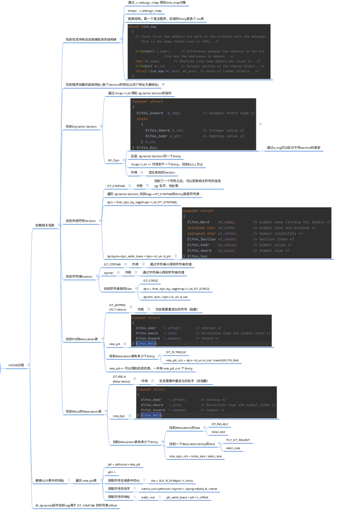
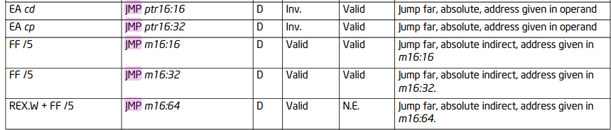

This documentation is not meant to provide a comprehensive collection of everything I learned during the development of PltHook. By writing this document I intend to:

- Summarize key concepts, challenges, corresponding solutions, and collect links for study materials.
- Provide a memo for myself
- Give professors a clear view of my progress 
- Provide a good starting material for people who would like to work on this after me.

# Notes

## Dynamic linking Mechanism

The ultimate goal for plthook library is to intercept all external function calls without modifying user's program. To achieve this, we need to have a good command of dynamic link mechanism in OS. 

### ELF format

ELF is the format of executable files in \*nix system. On disks, all executables are stored in this format. In memory, all executables are loaded into ELF format. To understand dynamic linking mechanism, we first need to understand ELF Well.

>  [Wikipedia](https://en.wikipedia.org/wiki/Executable_and_Linkable_Format); Ch 3 and 7 of Book [程序员的自我修养—链接、装载与库]() provides a comprehensive introduction for this part.

- Sections and Segments

The first important thing in ELF file is section and segment. Data of the same function are grouped into a section. For example, all assembly code are stored in .text section and all symbol name is stored in .symtab. This information is important for linkers, because they need to perform different action based on different kind of data. However, when code are loaded into memory into an ELF image. The operating system don't care about the content typle anymore. It only cares about what's the permission of different area. To reduce fragmentation, sections with the same permission are grouped into a segment. So a segment can contain >=0 sections.

- Relocation Table

Address for external symbols can only be set after linking. Compilers would use pseudo address for those symbols during compilation.  So we need to know how to find those symbols in a compiled program. For relocatable files (eg: *.o) r_offset is the offset of that symbol with respect to the start of its segment. For executable files (eg: *.so/File with no extension)  r_offset is the virtual address of the first byte of that external symbol. r_info contains the index of that symbol and the type of that symbol (Type specifies how to calculate the actual address). We could use relocation table to get all external symbols. If .text has symbol that requires relocation, then a .rel.text table is generated.

### Loading

> Ch 6 of Book [程序员的自我修养—链接、装载与库]() provides a comprehensive introduction for this part.

ELF files are loaded into memory through ELF iamges.

Use /proc/self/map to check loading address

### PLT and GOT

## X86 Assembly

GCC use AT&T syntax, but AT&T syntax don't seem to have a complete brochre.
The correct way to do things is to take intel's x86 assembly manual as a reference and convert code into AT&T syntax.

## Replace GOT Entry

### JMP

I should use far jump.

[Intel Brochure 3-488   Vol. 2A](https://www.intel.com/content/dam/www/public/us/en/documents/manuals/64-ia-32-architectures-software-developer-instruction-set-reference-manual-325383.pdf)

When the CPU executes an unconditional transfer, the offset of destination is moved into the instruction pointer, causing execution to continue at the new location.

# Challenges and solutions

### Call original functions without signature

The hook function don't know the signature of original function. So it's impossible to call original function using C/C++. 

The solution to this is to use in-line assembly.

### Identify which function to call

After replacing the GOT entry with a hook function. When that hook function is called there's no chance to know which is the original function.

Solution 1:
Generate a source code file on-the-fly. Create a function for each external symbol, hard-code function address in hook function. Then, compile and load that .so file. Replace GOT with loaded function.

Solution 2:

Hard-code binary code in memory and let GOT point to corresponding code.

Inline hook (Related) https://blog.csdn.net/arvon2012/article/details/7766439