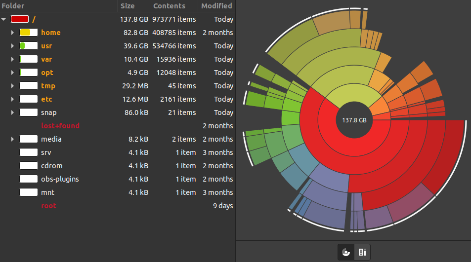
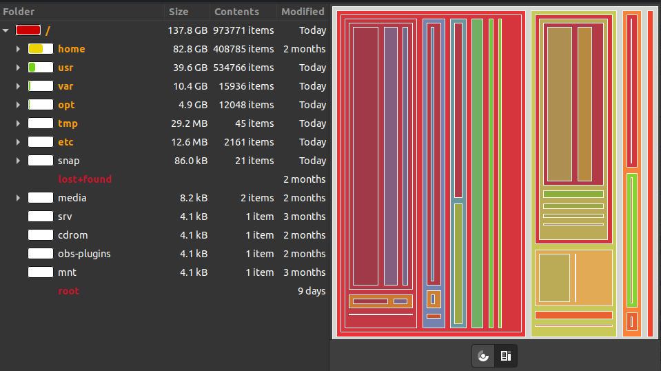
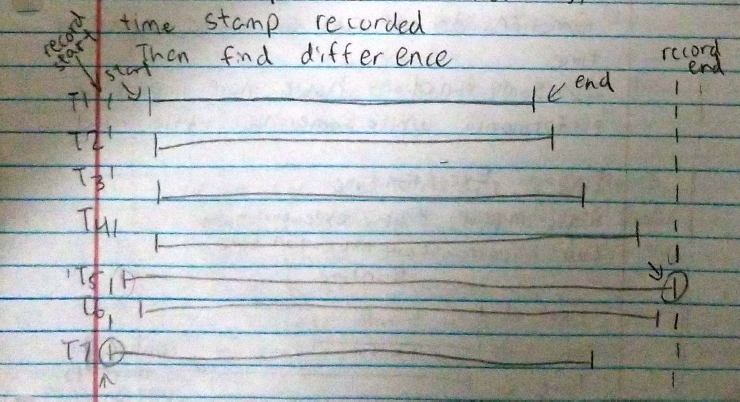

[toc]

# Format

> The format should be.
>
> Try to use markdown editor (eg: Typora, Github Web IDE to make sure the format is correct)
>
> Use emojis to distinguish
>
> - Things that haven't been discussed with anyone :mag:
> - Things that discussed between steven and john but need to report to the professor: :bulb:
> - Things valuable after discussion: :heavy_check_mark:
> - Things invaluable after discussion: :x:
> - Things that have been discussed, but need further investigation :question:
>
> ```
> # Section Name
> ## Subsection Name
> 
> ### Issue_Category_Number - Category
> 
> ### Issue_Category_Number - Issue_Number Breif_Description
> 
> - :emoji: Thought 1
> Descriptions about your idea
> 	- :emoji: Comment 1
> 	Some comments regarding thought 1
> 	- :emoji: Comment 2 
> 	Some comments regarding thought 1
> - :emoji: Thought 2
> Descriptions about your idea
>     - :emoji: Comment 1
>     Some comments regarding thought 2
>     - :emoji: Comment 2
>     Some comments regarding thought 2
> ```
>
> 

> To ensure most effective communication: 
>
> 1. Always use **Topic sentence** + Details.  Set topic sentence to **bold typeface**.
> 2. Change paragraph if you are talking about things not covered by topic sentence.
> 3. Be brief is possible
> 4. Use markers. bullet points
> 5. Use figure to show what you mean

# Background

**We already collect data through tracing based method. How to present these data?**  We currently collect a tuple of 4 (timestamp, library name, thread id, function name) and the function invocation sequence. (Not call stack, but only external function invocation sequence).

**The overall goal is to provide a visualization that tells users which component they should primarily focus on.** Preferably, the tool should report relative importance of each functions. (eg: If the visualization tool shows libraryA is more important than libraryB, then it should mean fixing libraryA would get more benefits).

**To achieve this goal, we may meet challenges.** For example, a component that takes more averaged execution time may not necessarily mean it is the most worthy component to fix. 

**We should think about two types of questions**: 

1. Which factors may cause averaged time to not reflecting the most worthy component to fix? 
2. What's the potential solutions to fix these problems?

## :question: A2-How to identify abnormal threads (Thread imbalance) if we have thousands of threads?

- :x: Thought 1
  **I have an idea about how to find the bottleneck among many threads.** Maybe we could merge all thread's call stack and latency information into a single graph. Find subgraphs that overlaps with most call-stack. And find thread who has significantly more execution time than its counterparts.

  - :heavy_check_mark: Comment 1

    **This is not our goal.** Our goal is to report some statistic data rather than correlate data together. We only need to report which component is the most worthy to fix.

- :x: Thought 2

  **We could ask developers to mark requests that they care.** Developers could marks functions and requests inside the develop machine and "teaches" profiler how to profile. And profilers use that information to find similar requests inside an application without debugging info. We then find similar requests inside a program in production.

  **In actual profiling process, we may even ignore requests that user doesn't want.** So the data will be cleaner and more accurate.

  - :heavy_check_mark: Comment 1

    **This is not our goal** The overall goal is to report statistical data. Detailed profiling is out of the scope.

    **User intervention is not preferred.**

- :question: Thought 3

  **We need to be able to measure or identify the relevance of a thread to other threads.** Relevance is talking about the similarity of a thread's task is to the tasks of other threads. For example: There may be threads designated to starting new threads whereas another thread is dedicated to performing some computation like matrix multiplication perhaps and another thread is dedicated to cleaning up memory.

  We may see that the first thread may not have very little impact on the overall execution, but if we do not count for relevance, in our final results we may falsely report that there is load imbalance because of how much execution the second thread takes up (since matrix multiplication is most likely more resource intensive than thread creation) where in reality, the "loads" of either thread have little relation to one another and thus changing the load of one thread does not directly affect the other. This is where relevance is important, **by knowing how relevant a thread is to another, we may more accurately understand how the changing of loads will affect the performance of the relevant threads.**

  **How do we measure relevance?** We may do this by grouping threads by their function (perhaps the  best way). If we can retrieve function parameters, we may compare inputs (This  is most likely the worst method as it would be probably is not scalable  when considering massive inputs) and grouping threads by similar inputs.

  - :heavy_check_mark: ​Comment 1

    Thread level analysis is the focus of another tool called syncperf and may not be helpful to our goal. 

  - :mag: ​Comment 2

    **The solution john proposes seem to be another usage of parameter analysis and input analysis described in A4.** Rather than doing it for every function. John thinks it's good to only analyze thread's "run" functions. His goal is to correlate similar threads together. 

    **Will this work? There are two problems ahread:** The first problem is, compared to functions like pthread_create, the parameter of thread "run" function is unfixed.  The second problem is: Thread run functions may not use parameters to pass data.

- :mag: Thought 4

  **If we want find abnormal threads, we must do better than syncperf.** 
  
  **To achieve our goal, we don't need to find abnormal thread.** What we need to do is just correctly attribute time taken by synchronization and consider the fact that a same function called in different threads have different contributions.

## :question:A3 - Better UI interface

### :question: A3-1 About Pie Charts
- :x: Thought 1

  **Pie-chart is not the optimal solution for finding tail latency problem?** For tail latency problem, an averaged thread will submerge in its peers. This cannot be found from pie chart.

  - :heavy_check_mark: Comment 1

    **Tail latency is not our focus.**

- :question: Thought 2

  A pie chart in the following can show more information on a graph. 

  

  

- :x: Thought 3

  **Pie charts can only show the symptom (some component is slow) rather than the root cause (why that component is slow).** Maybe a slow component itself isn't the problem, and the slow component is caused by other components which account for only a small fraction of time.

  But we need a good example other than thread synchronization to convince people this is true.

  - :heavy_check_mark: Comment 1

    **The goal of this tool is not finding the root cause.** We just need to report which component has the problem.

### :question: A3-2 Other Visualization Techniques

- :x: Thought 4

  Flame graph can show detailed call path. But it also hides threads with tail latency problem.

  - Comment 1
    **Tail latency is not our focus.** 

    **This graph will be briefly mentioned in section B.**

- :question: Thought 5

  **A Tree map might be a better and more compact visualization of our data.** Because it means we can represent all of the threads as a portion of the total execution where the total execution is the entire tree map. Then we can have the function and library portions representedx] as nested in their respective threads. This provides a more holistic view of the data as opposed to separate pi charts that require the user to click to view individual sections.

  

  - :heavy_check_mark: Comment 1
    **This doesn't improve pie-chat by much.** 

    **This graph will be briefly mentioned in section B.**

- Thought 6

  **Use Bar Chart to allow user to immediately compare threads.** 
  
  The reason I mention this is that it would be very difficult to represent every thread on a pie chart for comparison since we primarily use time as our metric. Threads can have true concurrency which means that the execution times of threads cannot be summed together to form a whole that is the total execution time otherwise we would be misrepresenting data. Thus Bar Charts are a good substitute as a user can immediately see a tall bar as important similar to seeing a large wedge on a pie chart. This bar could represent execution time or percentage of execution time for example.

### :question: A3-3 Visualization Problems to Solve

- :x: Thought-7

  **If we show profiling data by thread id, what if there are thousands of threads?**
  
  - :x: Comment 1
    **Categorize thread types, group similar threads together.** We may group similar threads by callstack and compare the overall latency of that callstack. If we find edge case, we report it. It should be the tail latency problem?

  - :heavy_check_mark: Comment 2

    **Comment1 is invaluable,** tail latency problem is another project.
    
  - :heavy_check_mark: Comment 3​
  
    **This may not be a problem.** Since our goal is to show which component the user should pay more attention. We may not explicitly show profiling data by thread id.
  
- :question: Thought-8

   **What Metric to Use?**
   - :mag: Comment-1
     
      **Execution time and Total Execution time**
  
      In terms of the pie chart, we can use total execution time to represent the whole of the pie chart and executions of perhaps threads or functions to represent the parts or wedges.
    
      **Threads would not work, this has been addressed above in thought 6, however we can do pie charts for specific threads like the initial pie chart examples we used** 
  
      In this case, we can use libraries or function call execution times to represent wedges while the whole is just the execution time of a specific thread
  
   - :mag: Comment-2
      
      In regards to comment-1 about function call or library execution times, we are not necessarily bound to just execution times. We can perhaps represent function calls or library calls as a portion of the thread's execution time (function duration/thread duration). 
     
      Or perhaps we could do a naive approach of averaging the execution times of a function call and just report that average. But this also requires adjustment of what the "whole pie" means as we are no longer reporting total execution time but instead the average execution time.

   - :mag: Comment-3
     
     **Number of function calls**
  
     In this case, we know that there is some total number of function calls recorded. Then we can represent the number of times a specific function occurred as a wedge. This wedge would then represent the frequency of function calls. This may not be of use to us, but may be good to take note of.
  
  


## :x:A4 - Parameter Analysis

### A4-1 Find the relationship between parameters and performance

- :x: ​Thought 1

**We can automatically analyze all function parameters and find the relationship between parameter and performance.** For some known APIs eg: pthread library, system call. We already know their signature, so we can parse the parameters and do some analysis on them. Eg: Use them as ML features to predict latency .etc. 

- :heavy_check_mark:Comment 1

  **This is not our goal.** We aim to provide a more systematical profiling.

  **Parameter analysis is only required for known functions.**

### :mag: ​A4-2 Measure thread relevance based on parameter analysis

-  Thought1 

  See A2,Thought 3​

## :heavy_check_mark:A6 - Overcome stack protection

- :heavy_check_mark: Thought 1

  Make libScalerHook work with libraries that compiles with stack protection. (Need to check how other tools bypass such limit. Maybe it's doable maybe it's not. For libraries that enables Intel CET, I think libScalerhook won't work at all. But intel CET seems to be disabled by default, so we may only need to worry about stack pointer protection.)

## :bulb:A7 - Debugging symbol sideload

- :bulb: Thought 1

  We could load debugging symbols separately with libScalerhook, so we don't require debugging symbol in target application, but we still have debugging information.


##  :bulb:A8 - Code injection

- :question: ​Thought 1

  Inject code into process rather than use dynamic link it to reduce dependency requirement.

  - Comment 1
    **Without this, we can also achieve our goal.**
    
    **Whether dynamic linking is a bing drawback? If not, why bother to implement this?**

## :x:A9 - Dynamic profiling

- :x: Thought 1
  Uninstall hook for functions that doesn't change a lot in execution time, input data .etc

  - :heavy_check_mark: ​Comment 1

    Good idea. But since we do not plan to further work on this. We won't implement in libScalerHook.
  
  - :mag: ​Comment 2
  
    Whether parameter analysis is feasable.

## :heavy_check_mark: A11 - How to aggregate time? 

### :heavy_check_mark:  A11-1: Examples that shows a naive, averaging approach isn't enough.

-  :mag:Thought 1

  **In multi-threaded applications, different functions may have different contributions to the overall execution time**

  eg1: These two functions will have the same contribution. Functions in serial phase and parallel phase should have the same weights.

  figure

  eg2: These two functions will have different contribution. Functions in serial phase should have more weights.

  figure

  eg3: These two functions will have different contribution. Functions in parallel phase should have more weights.

  figure

### :heavy_check_mark:A11-2: Casual profiling

- :question:Thought 1

  If it's possible calculate potential speedup? If so, functions that have more potential contribution should have more weights. 

### :heavy_check_mark: A11-3: How to measure synchronization overhead?

Work zone

- :heavy_check_mark: Thought 2
  **We can retrieve signature of thread creation functions to intercept thread synchronization.** eg: pthread_create(). 

  - :heavy_check_mark: Comment 1

    **To know the thread function, we would have to somehow retrieve that from the signature** (Maybe something like a function id or address). 
    **We don't have to know what the function is in specific.** Perhaps we simply need to know that multiple threads are calling the same thread function. 

   - :x:  Comment 2

     **This approach have two potential problems.** One problem with this is: Would have to have prior knowledge of thread creation function and search for them in particular. Or somehow have a systematic way of identifying thread creation functions. (Cannot simply assume that pthread_create() is the main function used to create threads, maybe there is some other thread creation function that was used like a proprietary or self made function, unless this is not a issue.)

   - :heavy_check_mark: Comment 3

     **Comment 2 is not a problem.** We can assume pthread_create would be the creation method**.** We don't have many APIs to intercept, so it would be enough to manually find these APIs. 
     **Comment 1 is what we will do**, we need some prototypes.

### :mag: A11-4: How to measure total execution time?

- :x: Thought 1

   **Treat thread with longest execution time as the total execution time**
   
   - :heavy_check_mark: Comment 1
     
     **Threads do not necessarily start the same time** This means that a thread can start late and still have the longest execution time, but we lost information about the time before the thread's creation. As seen in the image.
     
     
     
     In this example, we can see that T7 started earlier but T5 has a much longer execution time. If we were to report T5's execution time, we lost information about the time before T5's creation. Which would then mean when trying to perform calculations with the total execution time with threads like T7, we would be misrepresenting T7's time.
  
- :mag: Thought 2
  
   **Use the earliest timestamp and the latest timestamp recorded to calculate total execution time** This is to solve the problem posed in Thought 1 above. In the image above, this is indicated by the two circles, one at the start of T7's execution and one at the end of T5's execution. Then we can calculate the total execution time to be the difference from the first timestamp to the other timestamp. This we include every thread in the total execution time.
     

## A11 - Other issues

### :question: ​A10-1 Check perf's data format to see whether perf's cycles represent function duration.

- :question: ​Thought 1

```
libScalerHook-d 82415  7488.768824:         97 cycles: 
        ffffffffaf476316 native_write_msr+0x6 ([kernel.kallsyms])
        ffffffffaf408328 x86_pmu_enable+0x118 ([kernel.kallsyms])
        ffffffffaf6136fd perf_pmu_enable.part.0+0xd ([kernel.kallsyms])
        ffffffffaf61ae27 __perf_event_task_sched_in+0x1a7 ([kernel.kallsyms])
        ffffffffaf4cf36d finish_task_switch+0xfd ([kernel.kallsyms])
        ffffffffaf4d783f schedule_tail+0xf ([kernel.kallsyms])
        ffffffffaf404468 ret_from_fork+0x8 ([kernel.kallsyms])
            7f21e2d47285 __GI___clone+0x35 (inlined)

libScalerHook-d 82415  7488.768829:       2489 cycles: 
        ffffffffaf476316 native_write_msr+0x6 ([kernel.kallsyms])
        ffffffffaf408328 x86_pmu_enable+0x118 ([kernel.kallsyms])
        ffffffffaf6136fd perf_pmu_enable.part.0+0xd ([kernel.kallsyms])
        ffffffffaf61ae27 __perf_event_task_sched_in+0x1a7 ([kernel.kallsyms])
        ffffffffaf4cf36d finish_task_switch+0xfd ([kernel.kallsyms])
        ffffffffaf4d783f schedule_tail+0xf ([kernel.kallsyms])
        ffffffffaf404468 ret_from_fork+0x8 ([kernel.kallsyms])
            7f21e2d47285 __GI___clone+0x35 (inlined)
```

**Steven and john have different opinions on what's the meaning of the cycles.** John thinks perf's cycle only report the longest duration in each sampling event, so there's no way to know how long each sub function actually executes. While steven thinks perf will report accurate sample count and just create a new output when it detects there's changes to call stack.

**Let's use an example to illustrate the difference.** For example, john thinks in this example the output of perf can only tell us  **native_write_msr+0x6** took 97 cycles + 2489 cycles. **x86_pmu_enable+0x118** may take fewer cycles, but perf doesn't record it. While steven thinks the previous output means the first part of stack trace doesn't change for 97 cycles, and then switched to the stack trace on the bottom. So it can tell us  **native_write_msr+0x6** took 97 cycles + 2489 cycles, **x86_pmu_enable+0x118** also took  97 cycles + 2489 cycles.