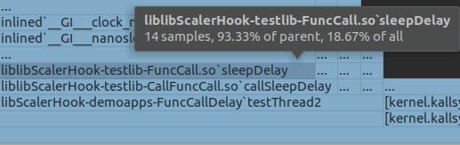
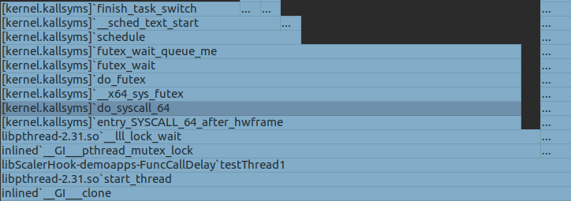

# Perf

## Features

Perf can already report figures in ReadMe.md

- Perf is able to profile external functions in both application and library.

- Perf is able to report kernel functions

  

- Perf is able to report of the percentage of each function.

- Perf doesn't require debugging symbol
- Perf uses kernel supported CPU performance counters, tracepoints, kprobes, and uprobes to intercept function execution. While scaler intercepts PLT table to implement hook. 

# Overhead

|               | CPU(with perf) | CPU(no perf) | CPU overhead | MEM(with perf) | MEM(no perf) | MEM overhead |
| ------------- | -------------- | ------------ | ------------ | -------------- | ------------ | ------------ |
| blackscholes  | 134.08         | 136.81       | 0.980045318  | 957780         | 628020       | 1.525078819  |
| bodytrack     | 272.37         | 278.17       | 0.979149441  | 2549164        | 33624        | 75.81382346  |
| canneal       | 245.68         | 232.43       | 1.057006411  | 1923628        | 872484       | 2.204771663  |
| dedup         | 76.24          | 65.63        | 1.161663873  | 1471312        | 1436496      | 1.024236754  |
| ferret        | 427.02         | 412.11       | 1.036179661  | 3227772        | 120816       | 26.71642829  |
| streamcluster | 844.8          | 796.2        | 1.06103994   | 7677152        | 112848       | 68.03090883  |
| swaptions     | 355            | 358.83       | 0.989326422  | 2780888        | 8048         | 345.5377734  |