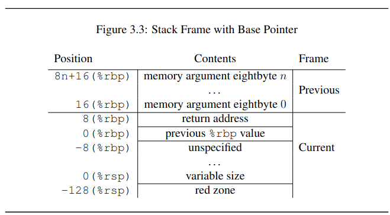
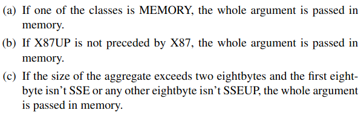
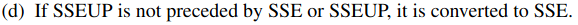
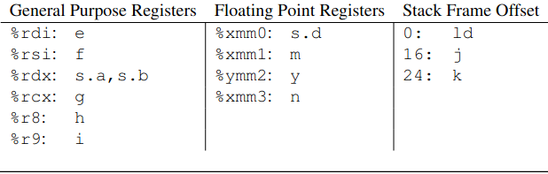
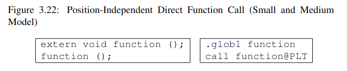
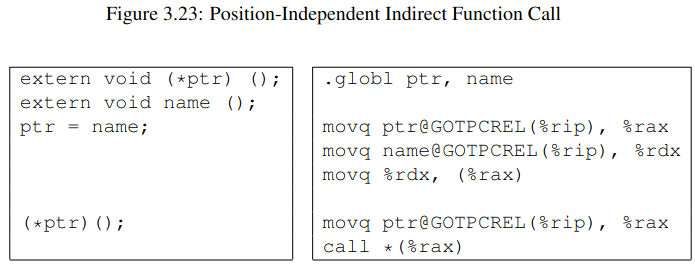
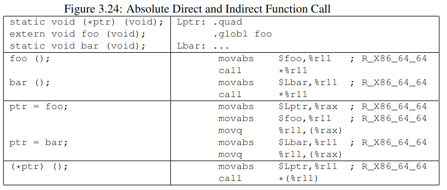
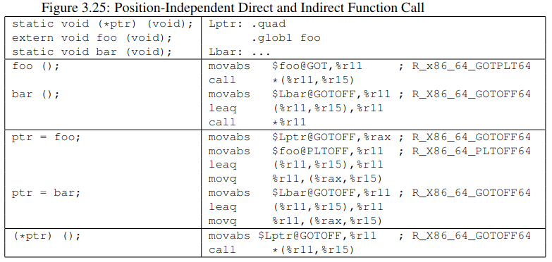

# Clarifications for CPU architecture naming

There are various names for different architectures which may leads to confusion for beginners. This section provides a clear view for different names and the architecture they are referring to.

To see a complete list of CPU architectures Linux support check [Wikipedia](https://en.wikipedia.org/wiki/Comparison_of_Linux_stributions#Instruction_set_architecture_support).

### x86-32

**x86** is a term used to describe a CPU instruction set **compatible with the Intel 8086 and its successors**. The term "x86" came into being because the names of several successors to Intel's 8086 processor end in "86", including the 80186, 80286, 80386 and 80486 processors. Scaler currently targets on x86 architecture CPUs that are widely used in desktop computers.

Synonyms:

- x86
- x86-32
- X32 (Often people)
- IA-32
- i386

### x86-64

**x86-64** is a 64-bit version of the x86 instruction set, first released in 1999. It introduced two new modes of operation, 64-bit mode and compatibility mode (compatible with x86-32), along with a new 4-level paging mode. 

Synonyms:

- x86-64
- AMD64
- X64
- Intel EM64T
- Intel 64

### IA-64

**IA-64** is the instruction set architecture (ISA) of the Itanium family of 64-bit Intel microprocessors. It's not compatible with x86-64.

Synonyms:

- Itanium

## 

# System V Application Binary Interface

The System V Application Binary Interface is a set of specifications that detail calling conventions, object file formats, executable file formats, dynamic linking semantics, and much more for systems that complies with the X/Open Common Application Environment Specification and the System V Interface Definition. It is today the standard ABI used by the major Unix operating systems such as Linux, the BSD systems, and many others. 

Check the [documentation](https://uclibc.org/docs/psABI-x86_64.pdf) for details.

Other links:

-  [OSDev](https://wiki.osdev.org/System_V_ABI)

## Function calling sequence

The standard calling sequence requirements apply only to global functions. Local functions that are not reachable from other compilation units may use different  conventions. 

### Registers

**Hardware**

AMD64 architecture has the following registers:

- 16 64bit GPRs
- 16 SSE registers each 128 bits wide. (Also known as vector registers)
- 8 x87 float point registers, each 80 bits wide (Also known as MMX registers)
- 16 256-bit AVX registers (Also known as vector registers)
  - ymm0-ymm15
    - xmm0-xmm15 are the lower 128bits of ymm*

**Caller saved or callee saved?**

- rbp, rpb and r12-r15 belongs to the calling function. The called function should preservee their values
- Remaining registers belong to the called function.

CPU shall be in x87 mode upon entry to a function. Every function  that  uses  the MMX registers  is  required  to  issue  an *emms* or *femms* instruction after using MMX registers, before returning or calling another function.

*DF* flag in the %rFLAGS register must be clear (set to forward direction) on function entry and return.

Other flags have no specified role in the standard calling sequence 

Control bits of *MXCSR* register are callee-saved, status bits are caller saved. x87 status word register is caller-saved. x87 status word register in caller-saved, whereas the x87 control word is callee-saved.

## Stack frame

The end of the input argument area shall be aligned on a 16 (32, if__m256 is passed on stack) byte boundary.




**Finding values in the stack**

**rsp** points to the end of the latest frame.

**rbp** is called frame pointer. And arguments is referenced by **rbp**. The stack frame may be avoided by using **rsp** to save two instructions in the epilogue and makes one additional GPR (rbp) available.


**Red zone**

The 128-byte area beyond the location pointed to by %rsp is considered to be reserved and shall not be modified by signal or signal handlers.

In particular, leaf functions may use this area for their entire stack frame,rather than adjusting the stack pointer in the prologue and epilogue.

[Why Red zone](https://softwareengineering.stackexchange.com/questions/230089/what-is-the-purpose-of-red-zone)

The prologue and epilogue of each function call can save two instructions that would save and restore rbp:

```
pushq %rbp       # prologue [ two instructions not necessary ]
movq %rsp,%rbp

.... [code]

movq %rbp,%rsp   # epilogue [ two instructions not necessary ]
popq %rbp        
```

[Why Red zone won't corrupt?](https://stackoverflow.com/questions/57465132/how-system-v-abis-red-zone-is-implemented)

[Why do we even need to define a red zone? Can’t I just use my stack for anything?](https://devblogs.microsoft.com/oldnewthing/?p=100685)

The authors conclusion is, normal developers shouldn't use redzone in their code.

[GDB and redzone](https://eklitzke.org/red-zone)

The x86-64 ABI makes an interesting guarantee. It guarantees that at any time you can access up to 128 bytes past `%rsp`. This is called the [red zone](https://en.wikipedia.org/wiki/Red_zone_(computing)). (Which should be false)

This is really useful for GDB scripting because it gives you 128 bytes that you can just use without calling `malloc()` or related routines.

This article suggests, that rather than skip redzone, we should use redzone.

[Understand Redzone with a concrete example](https://stackoverflow.com/questions/55271754/understanding-stack-and-red-zone-of-a-c-program)

Stack protector

## Parameter parsing

Parameters are placed either in stack or in register.

### Type of arguments

- **Integer**

  Integral types that fit into one of the GPR

  - _Bool, char, short, int, long, long long, pointers
  - \_\_int128 uses two GPRs to store low and high bits, and must be aligned to 16-byte boundary
  - If  a  C++  object  has  either  a  non-trivial  copy  constructor  or  a  non-trivial destructor, it is passed by invisible reference (the object is replaced in the parameter list by a pointer that has class INTEGER)

- **SSE**

  Types that fit into a vector register

  - float, double, _Decimal32, _Decimal64 and __m64
  - \_\_float128, _Decimal128 and \_\_m128 least significant 8 bytes
  - \_\_m256 least significant 8 bytes 

- **SSEUP**

  The class consists of types that fit into vector register and can be passed and returned in the upper bytes of vector register.

  - \_\_float128, _Decimal128 and \_\_m128 most significant 8 bytes
  - \_\_m256 most significant 24 bytes 

- **X87**

  Types that will be returned via x87 FPU.

  - 64-bit mantissa of long double

- **X87UP**

  Types that will be returned via x87 FPU.

  - 16-bit exponent + 6 bytes of padding for long double

- **Complex x87**

  Types that will be returned via x87 FPU.

  - complexT has two parts real and imag. Each part is a double or float
  - complex long double


- **NO_CLASS**

  Used as padding, empty structures and unions.

  - If the size of the aggregate exceeds a single eightbyte,  each is classified separately. Each eightbyte gets initialized to class NO_CLASS.
  - 

- **MEMORY**

  Types that will be passed and returned in memory via stack
  
  - An object larger than four 8 bytes (32bytes ,256 bits) or it contains unaligned fields
  - For the processors that do not support the \_\_m256 type, if the size of an object is larger than two eight bytes and the first eight byte is not SSE or any other eight byte is not SSEUP, it still has class MEMORY.
  - A C++ object has either a non-trivial copy constructor or a non-trivial destructor, it is passed by invisible reference. (The object is replaced in the parameter list by a pointer that has class INTEGER)

For objects:





### Arguments passing

- If the class is **MEMORY**, pass the argument on the stack.
- If the class is **INTEGER**, the next available register is used in sequence **%rdi**, **%rsi**, **%rdx**, **%rcx**, **%r8** and **%r9**.
- If the class is **SSE**, vector register is used, the registers are taken in the order from **%xmm0** to **%xmm7**.
- If the class is **SSEUP**, the eightbyte is passed in the next available eightbyte chunk of the last used vector register.
- If the class is **X87**,**X87UP** or **COMPLEX_X87**, it is passed in memory.

If there are no registers available for any eightbyte of an argument, the whole argument is passed on the stack. If registers have already been assigned for some eightbytes of such an argument, the assignments get reverted.

Once registers are assigned, the arguments passed in memory are pushed on the stack in **right to left** order.

When passing \_\_m256 arguments to functions that use varargs or stdarg, function prototypes must be provided.

### Return values

- Classify the return type with the classification algorithm
- If the type has class **MEMORY**, then the caller provides space the the return value and passes the address in **%rdi**. **%rax** will contain the address that has been passed by the caller in %rdi
- If the class is **INTEGER**, the next available register of the sequence **%rax, %rdi** is used.
- If the class is **SSE**, the next available vector register of the sequence **%xmm0, xmm1** is used.
- If the class is **SSEUP**, the eight byte is returned in the next available eightbyte chunk of the last used **vector register.**
- If the class is **X87**, the value is returned on the X87 stack in **%st0** as 80-bit x87 number.
- If the class is **X87UP**, the value is returned together with the previous X87 value in **%st0**.
- If the class is **COMPLEX_X87**, the real part of the value is returned in **%st0** and the imaginary part in **%st1**.

Parameter passing example:

```
typedef struct {
    int a, b;
    double d;
} structparm;
structparm s;
int e, f, g, h, i, j, k;
long double ld;
double m, n;
__m256 y;

extern void func (int e, int f,
                  structparm s, int g, int h,
                  long double ld, double m,
                  __m256 y,
                  double n, int i, int j, int k);
                  
func (e, f, s, g, h, ld, m, y, n, i, j, k);
```



## Code models

In order to improve performance and reduce code size, it is desirable to use different code models depending on the requirements.  

> There are more differences between each model than introduced. I only included things that scaler should pay attention to.
>
> Currently, I didn't find where it documents large/medium/small model. The rule of thumb is: If something doesn't work, try another way. The important part is the example code.
>

#### Small code model

Virtual address is known at link time. All symbols are known to be located in the virtual address within a certain range. 

#### Kernel code model

It has minor difference with the small model in the range of signed/unsigned address encoding.

#### Medium code model

The model requires the compiler to use movabs instructions to access large static data and to load addresses into registers. Data section is split into two larts: normal and large. Data larger than 65535 is placed in the large data section.

#### Large code model

The compiler is required to use movabs instruction. Indirect branches are needed when branching to address whose offset from the current instruction pointer is unknown.

#### Small code model with PIC

Virtual addr of instructions and data are not known until dynamic link time. Addresses are relative to instruction pointer.

#### Medium code model with PIC

Instruction pointer relative addressing can **not** be used directly for accessing large static data, since the offset can exceed the limitations on the size of the displacement field in the instruction. Instead an unwind sequence consisting of **movabs**, **lea** and **add** needs to be used.

#### Large code model with PIC

It make no assumptions about the distance of symbols. The large PIC model implies the same limitation as the medium PIC model as addressing of static data. 

### PLT prologue

#### Small code model

Since all references for symbol is resolved by the linker at runtime in this model. There's no PLT required

#### Medium code model

A medium model can reference GOT directly.

```
leaq     _GLOBAL_OFFSET_TABLE_(%rip),%r15 # GOTPC32 reloc
```

#### Large code model

```
   pushq    %r15                          # save %r15
   leaq     1f(%rip),%r11                 # absolute %rip
1: movabs   $_GLOBAL_OFFSET_TABLE_,%r15   # offset to the GOT (R_X86_64_GOTPC64)
   leaq     (%r11,%r15),%r15              # absolute address of the GOT
```


### Function Calls

#### Small and Medium Models

Position independent direct function call:



Position independent indirect function call:



#### Large Models

Absolute Direct and Indirect function call

> movabs moves an absolute immediate rather than rip-relative LEA to registers.



Position-independent direct and indirect function call



## Calling convention

### For user-space

Parameters to functions are passed in the registers `rdi`, `rsi`, `rdx`, `rcx`, `r8`, `r9`, and further values are passed on the stack in reverse order. Parameters passed on the stack may be modified by the called function. Functions  are called using the `call` instruction that pushes the address  of the next instruction to the stack and jumps to the operand. Functions return to the caller using the `ret` instruction that pops a  value from the stack and jump to it. The stack is 16-byte aligned just  before the call instruction is called.

Functions preserve the registers `rbx`, `rsp`, `rbp`, `r12`, `r13`, `r14`, and `r15`; while `rax`, `rdi`, `rsi`, `rdx`, `rcx`, `r8`, `r9`, `r10`, `r11` are scratch registers (**They can change**). The return value is stored in the `rax` register, or if it is a 128-bit value, then the higher 64-bits go in `rdx`. Optionally, functions push `rbp` such that the `caller-return-rip` is 8 bytes above it, and set `rbp` to the address of the saved rbp. This allows iterating through the  existing stack frames. This can be eliminated by specifying the `-fomit-frame-pointer` GCC option.

Signal handlers are executed on the same stack, but **128 bytes  known as the red zone is subtracted from the stack before anything is pushed to the stack**. This allows small leaf functions to use 128 bytes of stack space without reserving stack space by subtracting from the  stack pointer. The red zone is well-known to cause problems for x86-64  kernel developers, as the CPU itself doesn't respect the red zone when calling interrupt handlers. This leads to a subtle kernel breakage as the ABI contradicts the CPU behavior. The solution is to build all  kernel code with `-mno-red-zone` or by handling interrupts in kernel mode on another stack than the current (and thus implementing the ABI).

### For kernel

The kernel interface uses %rdi, %rsi, %rdx, **%r10**, %r8 and %r9.

Kernel **destroys** registers **%rcx** and **r11**

The number of syscall has to be passed in register **%rax**

System-calls are limited to 6 arguments, no argument is passed directly on the stack

Register %rax has the result.

Only INTEGER and MEMORY parameters are passed in kernel.

Kernel doesn't use redzone.

