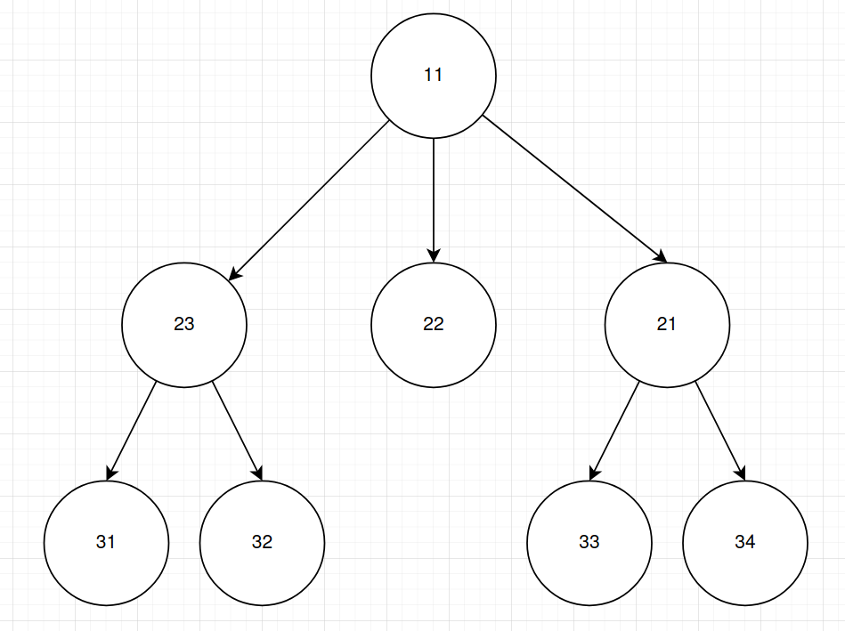
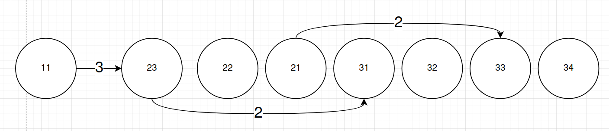

# Data format

Replace **boldface** with actual value.

eg: **number**.txt should have the form of 1.txt, 2.txt, 1958.txt .etc

## FileName

| Name template              | Comments                                            | Example                                     |
| -------------------------- | ------------------------------------------------------------ | ------------------------------------------------------------ |
| thread_0x**THREAD_ID**.bin | A serialized tree structure                     | See below |
| symbol_0x**THREAD_ID**.json | Map realFileID to fileName, and map (realFIleID, funcAddress) to function name. If there are no symbol, a nullptr will present. Check example. Functions that are not called by the current thread **is likely** to have realFileID==-1. Just ignore this. | {"0":{"fileName":"/home/st/Projects/Scaler/cmake-build-debug/libScalerHook/tests/libScalerHook-demoapps-ComplexThreadop","funcNames":null},"10":{"fileName":"/home/st/Projects/Scaler/cmake-build-debug/libScalerHook/libScalerHook-HookAuto.so","funcNames":null},"11":{"fileName":"/usr/lib/x86_64-linux-gnu/ld-2.31.so","funcNames":null},"2":{"fileName":"","funcNames":null},"3":{"fileName":"/usr/lib/x86_64-linux-gnu/libm-2.31.so","funcNames":null},"4":{"fileName":"/usr/lib/x86_64-linux-gnu/libgcc_s.so.1","funcNames":null},"5":{"fileName":"/usr/lib/x86_64-linux-gnu/libstdc++.so.6.0.28","funcNames":null},"6":{"fileName":"/usr/lib/x86_64-linux-gnu/libdl-2.31.so","funcNames":null},"7":{"fileName":"/home/st/Projects/Scaler/cmake-build-debug/libScalerHook/libScalerHook-HookManualAsm.so","funcNames":null},"8":{"fileName":"/usr/lib/x86_64-linux-gnu/libc-2.31.so","funcNames":{"140599153839040":"exit","140599153843856":"rand","140599153950032":"fprintf","140599153950224":"printf","140599154180704":"malloc"}},"9":{"fileName":"/usr/lib/x86_64-linux-gnu/libpthread-2.31.so","funcNames":{"140599155615952":"pthread_create","140599155620320":"pthread_join","140599155625920":"pthread_mutex_lock","140599155632048":"pthread_mutex_unlock","140599155642720":"pthread_cond_wait","140599155646176":"pthread_cond_signal"}}} |

### thread_0x**THREAD_ID**.bin

Data stored in layer-order traverse of a tree. The format is decided by the first attribute "type". Which is an integer defined in SerializableMixIn::Type. Same type has same size, different type has different size.

Use [Source Code](https://github.com/UTSASRG/Scaler/blob/dev-libScalerHook-brkpointptrace/libScalerHook/src/include/type/InvocationTree.h) as a reference to prevent bugs caused by outdated documentation.

For example:

SerializableMixIn::Type

| Name           | Value | Comments                              |
| -------------- | ----- | ------------------------------------- |
| UNSPECIFIED    | -1    | Should not happen                     |
| NORMAL_FUNC    | 1     | All other functions                   |
| PTHREAD_FUNC   | 2     | PTHREAD_FUNC+pthread specific fields  |
| SEMAPHORE_FUNC | 3     | NORMAL_FUNC+semaphore specific fields |

### NORMAL_FUNC

[Source Code](https://github.com/UTSASRG/Scaler/blob/c2f9eefa373754068e0f542be5380ebef0a454c1/libScalerHook/src/InvocationTree.cpp#L114)

| Name                               | Size              | Comments                                                     |
| ---------------------------------- | ----------------- | ------------------------------------------------------------ |
| SerializableMixIn::type            | 1 byte (int8_t)   | Use this to determine how many types are there.              |
| InvocationTreeNode::realFileID     | 8 bytes (int64_t) | This realfFileID of the executable that current symbol is implemented. Use this realFileID to index symbol.json to get executable name. For **root node**, this value is **0**, which means it's the application itself. |
| InvocationTreeNode::funcAddr       | 8 bytes (int64_t) | Use realfFileID and this funcAddr to index symbol.json to get symbol name. For **root node**, this value is **-1** (Meaning the application itself.) |
| InvocationTreeNode::startTimestamp | 8 bytes (int64_t) | Unix timestamp time in microseconds $1$ second=$10^6$ micro seconds. |
| InvocationTreeNode::endTimeStamp   | 8 bytes (int64_t) | Unix timestamp time in microseconds $1$ second=$10^6$ micro seconds |
| SerializableMixIn::firstChildIndex | 8 bytes (int64_t) | The index for array item (Rather than index in bytes). Should be used for error check. |
| InvocationTreeNode::childrenSize   | 8 bytes (int64_t) | How many children a node ahs                                 |

### PTHREAD_FUNC

[Source Code](https://github.com/UTSASRG/Scaler/blob/c2f9eefa373754068e0f542be5380ebef0a454c1/libScalerHook/src/include/type/InvocationTree.h#L117)

| Name        | Size             | Comments                                  |
| ----------- | ---------------- | ----------------------------------------- |
| ......      | ......           | The same as NORMAL_FUNC                   |
| extraField1 | 8bytes (int64_t) | Different functions have special meanings |
| extraField2 | 8bytes (int64_t) | Different functions have special meanings |

For entire pthread function list check: [Source Code]( https://github.com/UTSASRG/Scaler/blob/c2f9eefa373754068e0f542be5380ebef0a454c1/libScalerHook/src/include/util/hook/ExtFuncCallHook_Linux.hh#L42)

| Function              | extraField1                       | extraField2                       |
| --------------------- | ----------------------------------------- | ----------------------------------------- |
| PTHREAD_CREATE        | Newly created thread's thread id (pthread_t, or hex value if converted to void*) | Empty |
| PTHREAD_*****JOIN*****    | Which thread the current thread is trying to join  (pthread_t, or hex value if converted to void*) | Empty |
| PTHREAD_MUTEX_*****   | Which lock current thread is trying to manipulate (mutex_t, or hex value if converted to void*) | Empty |
| PTHREAD_RWLOCK_*****  | Which rwlock current thread is trying to manipulate (pthread_rwlock_t, or hex value if converted to void*) | Empty |
| PTHREAD_COND_*****WAIT | Which condition variable current thread is trying to manipulate (cond_t, or hex value if converted to void*) | The mutex lock corresponding to this conditional variable (mutex_t, or hex value if converted to void*) |
| PTHREAD_COND_**{SIGNAL/BROADCAST}** | Which condition variable current thread is trying to manipulate (cond_t, or hex value if converted to void*) | Empty |
| PTHREAD_SPIN_*****    | Which spinlock current thread is trying to manipulate (pthread_spinlock_t, or hex value if converted to void*) | Empty |
| PTHREAD_BARRIER_***** | Which barrier current thread is trying to manipulate (barrier_t, or hex value if converted to void*) | Empty |

### SEMAPHORE_FUNC

[Source Code](https://github.com/UTSASRG/Scaler/blob/c2f9eefa373754068e0f542be5380ebef0a454c1/libScalerHook/src/include/type/InvocationTree.h#L130)

| Name        | Size             | Comments                                  |
| ----------- | ---------------- | ----------------------------------------- |
| ......      | ......           | The same as NORMAL_FUNC                   |
| extraField1 | 8bytes (int64_t) | Different functions have special meanings |

For entire pthread function list check: [Source Code]( https://github.com/UTSASRG/Scaler/blob/c2f9eefa373754068e0f542be5380ebef0a454c1/libScalerHook/src/include/util/hook/ExtFuncCallHook_Linux.hh#L75)

| Function              | extraField1                       | extraField2                       |
| --------------------- | ----------------------------------------- | ----------------------------------------- |
| SEM_* | Which signal current thread is trying to manipulate Semaphore id (sem_t, or hex value if converted to void*) | Empty |

